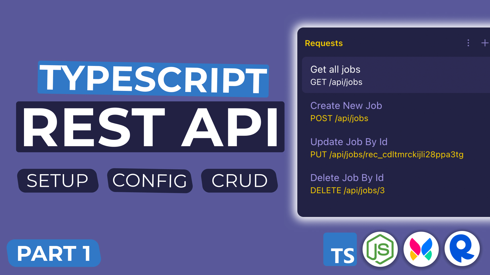
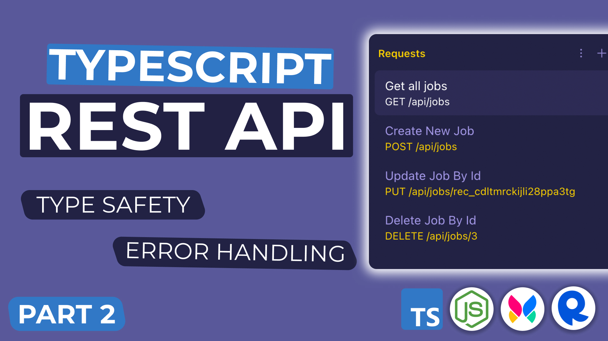

# Build a Node.js API with RapidAPI, TypeScript, and Xata.io

This is the source code for a [multipart YouTube series](https://youtube.com/playlist?list=PLDlWc9AfQBfaaubcN_YPuq0NlERt1rHAM) where you will learn to build a RESTful TypeScript API for a job board using Express.js, RapidAPI, and Xata.

## Part 1 - Setup, Config, and CRUD

## [Part 2 - Type Safety and Error Handling](https://youtu.be/pNK09uh_tHs)

## How To Use

There is a branch for each corresponding YouTube video. The finished code for Part 1 is in the `part1...` branch, Part 2 is in the `part2...` branch, etc.

## Questions?

If you have additional questions or feature requests, I recommend joining the [Learn Build Teach Discord server](https://learnbuildteach.com/) and asking there.
